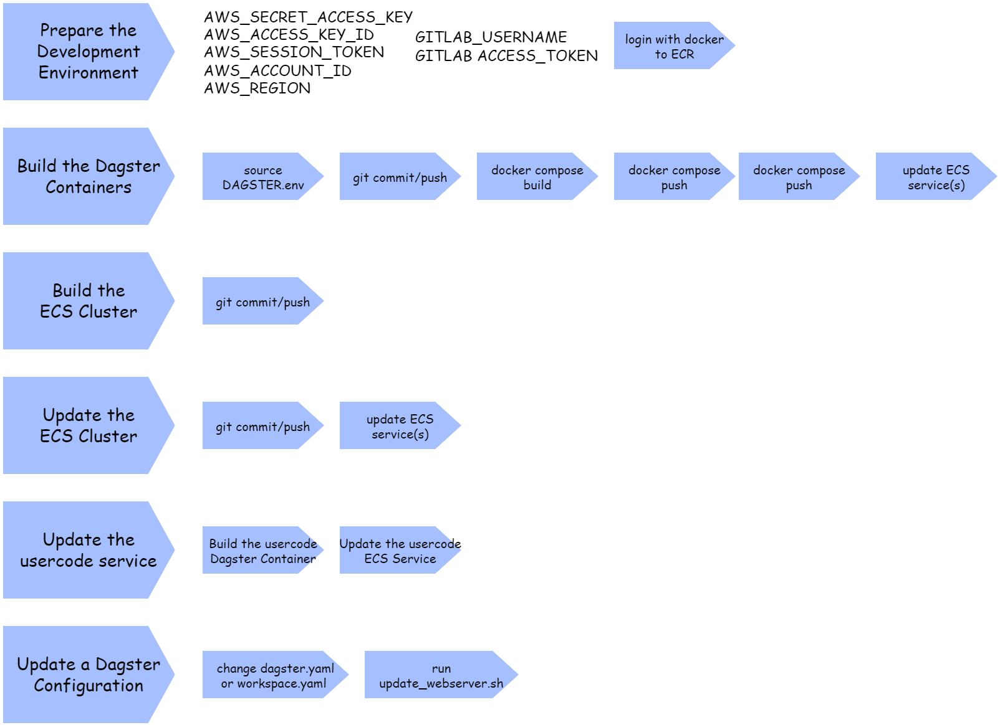

# Dagster on AWS ECS

Untested code! I quickly made a copy of an existing project to get collaboration running, had to remove some ip-sensitive information, and couldn't spend too much time on this here. Merge requests highly welcome. This is a work in progress.
The sidecar container idea is not yet fully implemented. It was inspired (and the S3 code was copied) from the [datarootsio/terraform-aws-ecs-dagster](https://github.com/datarootsio/terraform-aws-ecs-dagster) project. Use at your own risk ;)



# Build the System

## Prepare the Development Environment

Have the AWS environment variables set at your local environment:

* AWS_SECRET_ACCESS_KEY
* AWS_ACCESS_KEY_ID
* AWS_SESSION_TOKEN
* AWS_ACCOUNT_ID
* AWS_REGION

To push into the ECR registry, you need to have the proper login done (works only if already logged in to AWS CLI) and the registry URL set as an environment variable. This can be done with the following commands: 

```
export AWS_REGION=us-east-2 # or any other region as seen fit for the stage
export AWS_ACCOUNT_ID=$(aws sts get-caller-identity --output text | cut -f1)
export REGISTRY_URL=$AWS_ACCOUNT_ID.dkr.ecr.$AWS_REGION.amazonaws.com
aws ecr get-login-password --region $AWS_REGION | docker login --username AWS --password-stdin $REGISTRY_URL
```

##  Build the Dagster Containers

The etc/deploy_containers directory contains the current docker-compose.yml file and the Dockerfile for the containers.

When you want to create a new docker file release, you need to source DAGSTER.env file first. This sets the required environment variables for the docker-compose file and saves the gitrev-docker file with the current git revision. 

Then you can run the docker-compose build and push commands to build and push the containers to the registry. Be sure that code and docker have the same gitrev version.

Sequence when you want to create a new container release:
 `source DAGSTER.env` to set required environment variables for the database and crete the gitrev-docker file.
* `docker compose build` creates the containers locally.
* `git commit / push`, with the new gitrev-docker file saves the project. and runs the git pipeline to build and push the terraform code for ECS to the registry. The services can now take in the new container release.
* `docker compose push` to send the containers with the proper gitrev tag to the ECR container registry.
* Update the ECS services (force new deployment) to use the new container version.
 
 Not perfect, but it works. This surely can be automated with a script later

## Build the ECS Cluster

Terraform is used to create the ECS cluster. It is run by the git pipeline. 

var.gitrev is not defined in the git code, it must be passed into the script as variable. It signals the git revision of the project to be used when accessing the containers (if you are not interested in immutable containers, replace the occurences of `:${var.gitrev}` in `tasks.tf` by `:latest`, and manage the container pushes accordingly). 

The git pipeline sets this variable to the current git revision.
The cluster can be built even when the containers are not yet ready. The ECS cluster will be updated when the containers are present in the registry.

ECS Best Practices: https://docs.aws.amazon.com/AmazonECS/latest/bestpracticesguide/application.html

## Update the ECS Cluster

The ECS cluster is updated by the git pipeline. The pipeline runs the terraform code to update the ECS cluster. Some timing conditions might occur, so check in the console whether the update was successful. Constellations that might bring problems:
* task definition update. Task definitions might drain and keep a new version from being applied.
* ECS service update. Services might not be able to update if tasks as still running.
* Cloud Map update. Cloud Map might not be able to update if the underlying services are still up.

## Update the usercode service

Most often we might need to update the usercode server since by definition it contains the most volatile content. Proceed as described above but you only have to update the usercode service in this case. Only if the call interface changes, you have to update the webserver as well.

## Update the Dagster configuration

The terraform code creates an S3 bucket with a config key in it. Below that key, the configuration files are stored. On initialisation, the webserver container reads the configuration from the S3 bucket. When you want to update the configuration, you have to update the S3 bucket and the webserver container. Since the file transfer happens in the sidecar container, which exists after execution, The whole webserver service has to be updated to read the new configuration from the S3 bucket.

The `update_webserver.sh` script does this. It updates the webserver service and forces a new deployment. Run from the etc directory.
As well you can update the usercode server with the `update_usercode.sh` script.

## Open Issues
* create github automation code
* create health checks for the containers
* fix the destroy script for git terraform   
* don't use `latest` tag
* logging to stdout, stderr?
* ECR:  image_tag_mutability = "IMMUTABLE" - how to organize tags, AWS recommends using immutable tags coming from git sha
* ECS: use tag propagation, i.e. ECS creates tags for environment, service, etc.
* WARNING - Reloading definitions from a code server launched via `dagster api grpc` without restarting the process is not currently supported. To enable this functionality, launch the code server with the `dagster code-server start` command instead.
* Could we copy workspace.yaml to the webserver container without restarting the container,  e.g. shared EFS volume for all running containers...

# Run the System

## Dagster

### What to define in workspace.yaml

```
{ grpc_server?: 
{ host?: (String | { env: String }) 
  location_name?: (String | { env: String }) 
  port?: (Int | { env: String }) 
  socket?: (String | { env: String }) 
  ssl?: Bool 
  } 
  python_file: (String | 
    { attribute?: (String | { env: String }) 
      executable_path?: (String | { env: String }) 
      location_name?: (String | { env: String }) 
      relative_path: (String | { env: String }) 
      working_directory?: (String | { env: String }) }) 
  python_module: (String | 
    { attribute?: (String | { env: String }) 
      executable_path?: (String | { env: String }) 
      location_name?: (String | { env: String }) 
      module_name: (String | { env: String }) 
      working_directory?: (String | { env: String }) }) 
  python_package: (String | 
    { attribute?: (String | { env: String }) 
    executable_path?: (String | { env: String }) 
    location_name?: (String | { env: String }) 
    package_name: (String | { env: String }) 
    working_directory?: (String | { env: String }) }) 
}".
```

... to be completed